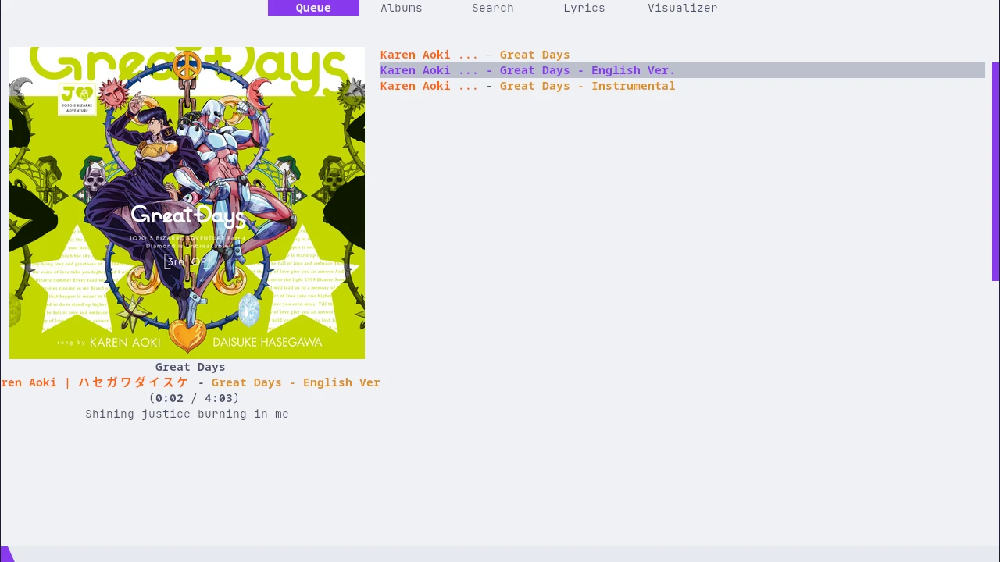
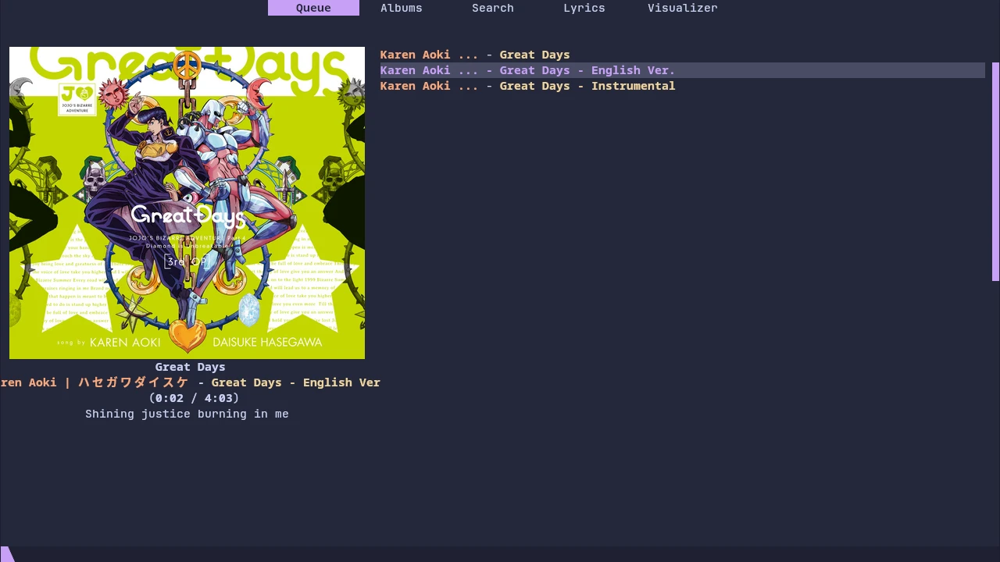
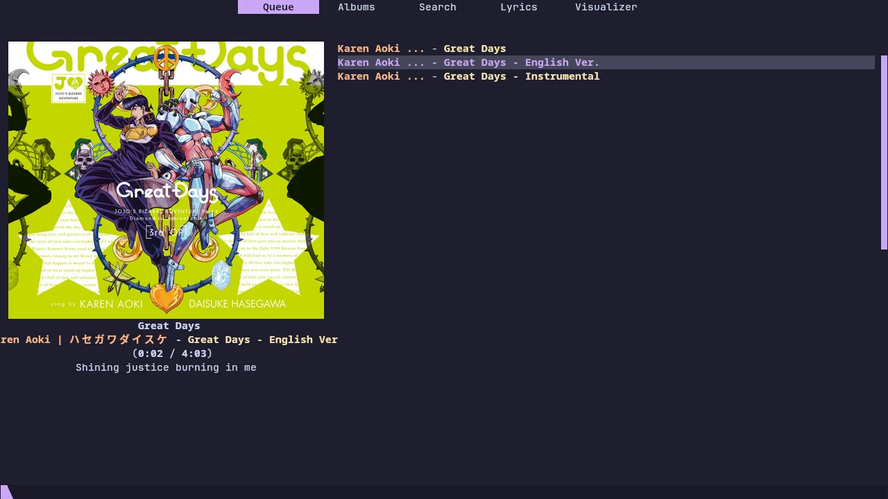

<h3 align="center">
	 
	
	Catppuccin for <a href="https://rmpc.mierak.dev/">rmpc</a>
	
</h3>

	
	
	

	

## Previews

🌻 Latte

🪴 Frappé

🌺 Macchiato

🌿 Mocha

## Usage
1. Ensure you have both `rmpc` and `cava` installed.
2. Copy all the files from the flavor of your choice from [`themes`](./themes) into `~/.config/rmpc/`

## 🙋 FAQ

- Q: How do you add automatic lyrics fetching?
- A: If you want it, please use `on_song_change` and add this shell script from [the docs](https://rmpc.mierak.dev/guides/on_song_change/#automatically-fetch-lyrics)

## 💝 Thanks to

- [BNDays27](https://github.com/BNDays27)

	

	Copyright &copy; 2021-present <a href="https://github.com/catppuccin" target="_blank">Catppuccin Org</a>

	

