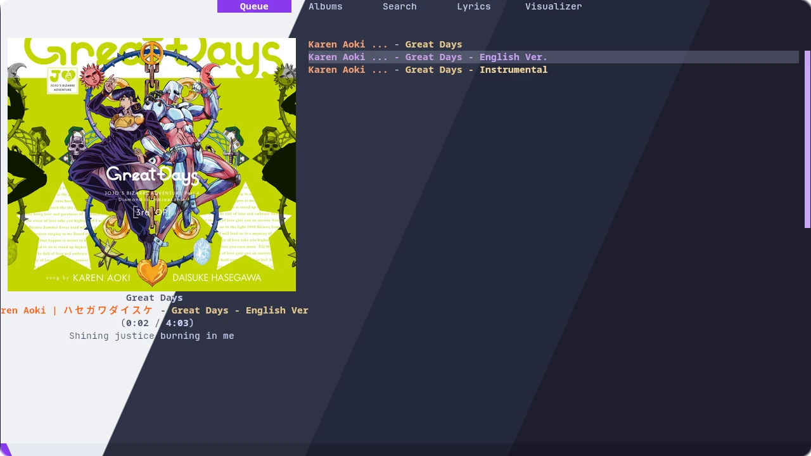

<h3 align="center">
	 
	
	Catppuccin for <a href="https://rmpc.mierak.dev/">rmpc</a>
	
</h3>

	
	
	

	

## Previews

🌻 Latte

🪴 Frappé

🌺 Macchiato

🌿 Mocha

## Usage
1. Ensure you have `rmpc`, `jq` and `cava` installed from your package manager of choice.
2. Copy all the files from the flavor of your choice from [`themes`](./themes) into `~/.config/rmpc/`

## 💝 Thanks to

- [BNDays27](https://github.com/BNDays27)

	

	Copyright &copy; 2021-present <a href="https://github.com/catppuccin" target="_blank">Catppuccin Org</a>

	

